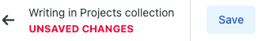
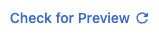
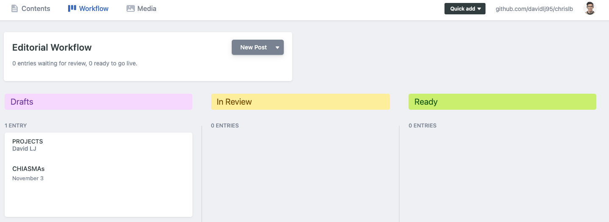
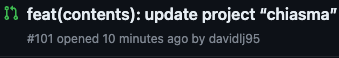
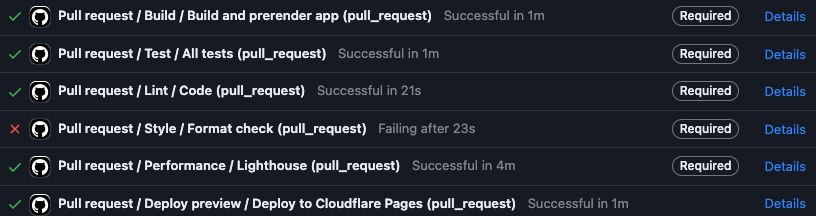

# Content management

## Resources

### Main contents

Website contents are stored in plain JSON files inside `data` and `content` directories under the `src` directory. Some small files that don't require optimizations can be hosted there too.

However, uploading contents to this code repository requires dev knowledge. In order to provide a seamless experience to non-dev users, those files can also be edited with a web user interface thanks to a [content management system (CMS)][CMS].

### Multimedia contents

#### Images

Images are managed by an [image content delivery network (CDN)][images CDN]. They're hosted there for performance purposes. The CDN dynamically generates images depending on the user's device accessing the website.

#### Videos

Videos are managed by [YouTube][YouTube videos]. They're hosted there for performance purposes. This way we leverage YouTube's years of experience of delivering video contents so that users of the website load videos as fast as possible with the maximum quality possible the network can deliver.

## General considerations

Disregarding of the platform where you are uploading, please do take into account the following considerations:

## Naming

### Slugs and other texts used in URLs

If typing or setting a:

- **Slug field** in the [CMS]
- **Directory name** in the [images CDN]
- **Image name** for an image in the [images CDN]

✅ **DO**

- Use **only lowercase**, **alphabetical**, **number**, or **hyphen (`-`)** characters (`a-z0-9-`)

⚠️ **AVOID**

- Use of **underscore (`_`)** and **.** character. They're not very friendly for search engines

❌ **DON'T**

- Use any other character rather than the above. Specially slashes `/`, question marks (`?`), ampersands (`&`) and equal signs (`=`)

> ℹ️ Those pieces of text 👆 will be used in URLs. URLs don't allow any character ever to be in there. They can be "escaped" to include them anyway, but sometimes it generates errors (had a few with the image CDN). Plus search engines do not like those escaped characters. So let's avoid them! You're free to use other characters in the rest of places :) (even emojis if you like)

## Content Management System (CMS)

[CMS]: #content-management-system-cms

Contents can be edited easily thanks to a CMS. To access it, just access the `/admin/` path:

https://christianlazaro.es/admin/

### GitHub account

Access to the make changes to the code repository is needed, given the CMS will create pull requests with content changes. For that reason, you'll need a [GitHub](https://github.com) account

### Basic: main workflow

When accessing some existing content, you'll see at top right corner two important links:


- **Live view**: links to where the current content can be seen (or to the main page if it's in many places / not in a specific place)
- **github.com/...**: links to the code repository of the website. Seems scare, but will be useful 👀

So now you edit some content, and a message will appear regarding content needs to be saved.



Once you save, a new request to change that content will be created. That request is known as a "Pull request" in the techie world 🤓. Given a website build process ⚙️ will start every time you press save, don't abuse the button!

> Though there are no limits on websuite builds we can do for free. But let's be eco-friendly and save some energy 🍃

It means that whatever you change, **will not yet be on the website!** This lets you play around editing content here and there until you're happy to publish.

So now the question is: where can I see my changes? After clicking "Save" and getting the success message, you'll see a change in top right corner:



Now there's not a link to "Live", but to check for "Preview" content. This means the website build process has started ⚙️ . You can go clicking in there to see if the preview has finished (or just wait). In some minutes (**normally < 2 minutes**), you'll see some other link in there


Click it, and you'll see a fresh new version of the website with your changes 🎉🪄

Notice that the URL in your address bar will not be the main website domain. But something in the fashion of

```
<randomThing>.chrislb.pages.dev/
```

This is a temporary domain for you to play with until you're happy with changes and deploy them to main website.

> ⚠️ If after some minutes the domain is the main one, there has been an error on the process 😢

You can leave the site now and leave the things for later. You can access them back by entering the same content, or using the [editorial workflow].

> You can indeed exit and edit multiple items at once. This way while you wait for a website build, you can go and do some other changes in parallel. As many as you like!

But if you're ready to deploy your changes to the main website, then just hit the "Publish" button 🚀. Another website build will be triggered (this one takes longer, ~5-10 minutes). After that, you'll see your changes there 🎉

> ❓If you can't publish, check the [status checking] section for more info on what happened. Maybe it's a little thingie!

### Basic: side effects

[side effects]: #basic-side-effects

Not only your new edited content will be there, but also:

- [Images from the CDN][images CDN] will be updated

So if you want to update existing images from the CDN in the site, just change something (a final space for instance). And you'll have the new images there.

### Basic: linking images

[linking images]: #basic-linking-images

Notice that when editing projects, images of projects do not appear in there. However, if you read the **slug** field definition, an explanation will be there about it. In few words, you must create a directory inside the `projects` directory in the [images CDN] with the same value as the `slug` field. In there, add a directory for each kind of image (you can check `chiasma` project for all kinds of project images you can create).

> ⚠️ If the `slug` field does not match **exactly** the directory name inside `projects`, image won't be able to be linked. Same will happen if directories inside that project directory do not match **exactly** some specific names (check the `chiasma` one). It's a bit ugly, but it's poor man honest work 😷
>
> This is why it's useful to preview changes before deploying them to main site! If something has failed, you can fix it before releasing it.

### Basic: other files

You can also upload other files with the [CMS]. For instance, in the "About" content, you can link your CV in PDF.

Avoid using the file loader to host big files. Or to load media files. Use instead the [images CDN] platform or the [videos platform] for that purpose.

### Medium: editorial workflow

[editorial workflow]: #medium-editorial-workflow

If you tap on the "Workflow" on the header...



You'll see the editorial workflow.

In there, you'll see the content that is being edited (have changes that have not been published yet). You can also tag them as draft, in review or ready to categorize how those changes are close to being released.

### Advanced: checking status of website builds

[status checking]: #advanced-checking-status-of-website-builds

If you want to see what is happening under the hood, you can check the **github.com/...** link in the top right corner. In there, check the "_Pull requests_" tab. You'll see something related to the change you're making. For instance, if you're doing changes to the "CHIASMA" project:



Click there and at the bottom, you'll see the website build status:



If you see something failing, click on the "Details" and maybe there you'll find what is exactly failing. If it's tech gibberish, contact your trusted developer🧑‍💻

> 💡 Providing them with the link of the failure will be great. You'll immediately be promoted to the category of "swooper-dooper-kwool user" 🏆😎

## Images CDN

[images CDN]: #images-cdn

Image assets of the project are hosted in an image CDN platform for [image optimization purposes](https://web.dev/image-cdns/#how-image-cdns-use-urls-to-indicate-optimization-options). [ImageKit.io] in this case.

By doing so, we deliver images with the right size. So that images are not too big (and therefore heavier) for users with small screens (mobile devices) but are big enough so that they aren't pixelated (laptop / desktop computers devices). This ensures the website loads as fast as possible 💨

[ImageKit.io]: https://imagekit.io

### Linking projects to images

To see how to link project images to projects, check the [linking images] section (inside the [CMS] section)

### Uploading new images

When you upload new images, those won't appear immediately, you'll need to change some content so the images list is fetched as part of the website build (see [side effects]). And then, new images will appear if they have been placed properly (see [linking images])

### Uploading / overwriting existing images

If you upload an image with same name, it will override the existing image.

⚠️ **Change will be published immediately to main website**

> ⚙️ **Work in progress** exists to remediate this behavior

### Removing images

If you remove images directly from the CDN, you'd see broken images in the website. Because image list files are generated at build time (see [side effects]). In order to remove images safely, without displaying missing images in the website, do the following.

1. **Move** the image(s) to remove to a separate folder. You can create a "trash" directory if you want
2. **Change** some content and publish a new website version. To update image lists so that they no longer contain those images (see [side effects])
3. **Wait** for the images not to be on the main website\*\*
4. **Remove** the image(s) when you want from that directory

### Creating new directories

Seems to give an error when doing it from the website. You can fix it by toggling the "Set custom metadata" option. And writing something (the "beautiful" name of the directory) in the "Alternative text" field.

### Other images

#### Horizontal logo and about page portrait

Horizontal logo and portrait image of the about page are expected to be located in:

- `logos/horizontal.png`
- `about/portrait.jpg`

**Do not change those directories or filenames**. Or otherwise the application will not be able to load those images up.

> If you check in the [CMS] for the about page metadata, you'll see that the portrait photo is used there. Be careful with that too, the URL in there is 🪄 and generates a squared 512x512px image from the portrait image with the face in the center. You can upload another one with the same name, and the squared 512x512px image will be automagically generated too.

### Squared logo

The process to include the squared logo is manual and [requires manually using other image generators and uploading results to specific files](https://github.com/davidlj95/website/blob/d87c7c33191ab6e8e323c90ab06f21f774131c3a/docs/favicon.md#favicon)

So manual developer hand is needed for that one :S

## Videos: YouTube

In order to host videos and deliver them as fast as possible with as much quality as the user's network allows, [YouTube] platform is used. You'll need to publish some videos and create a playlist from them.

You'll therefore need a Google Account to publish videos.

### Video upload tips

- Mark videos as "Hidden" if you don't want them to appear on your YouTube channel. Same for playlist.
- Disable comments if you don't want them.
- Take into account the video name, it will appear in the player.

### Linking videos to a project

When editing a project, checkout the YouTube playlist ID field. When you generate a playlist, and click the "Share" button, you'll get a link. You can extract the playlist ID from that link. For more info, check the field documentation which features an example playlist.

[videos platform]: #videos-youtube
[YouTube]: https://youtube.com
[YouTube videos]: #videos-youtube
